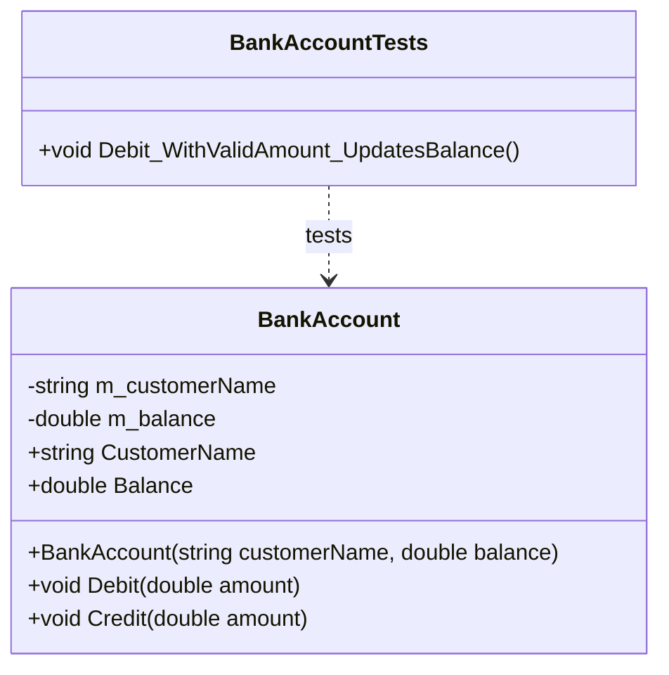

# Diagrama de Clases - Bank Application

## Descripción de Clases

### BankAccount
Clase principal que representa una cuenta bancaria.

**Propiedades:**
- `CustomerName` (string, readonly): Nombre del cliente
- `Balance` (double, readonly): Balance actual de la cuenta

**Métodos:**
- `Debit(double amount)`: Retira fondos de la cuenta
  - Lanza `ArgumentOutOfRangeException` si el monto es mayor al balance
  - Lanza `ArgumentOutOfRangeException` si el monto es negativo
- `Credit(double amount)`: Deposita fondos en la cuenta
  - Lanza `ArgumentOutOfRangeException` si el monto es negativo

### BankAccountTests
Clase de pruebas unitarias para BankAccount.

**Métodos de prueba:**
- `Debit_WithValidAmount_UpdatesBalance()`: Verifica que el método Debit actualice correctamente el balance

## Relaciones
- `BankAccountTests` depende de `BankAccount` para ejecutar las pruebas

