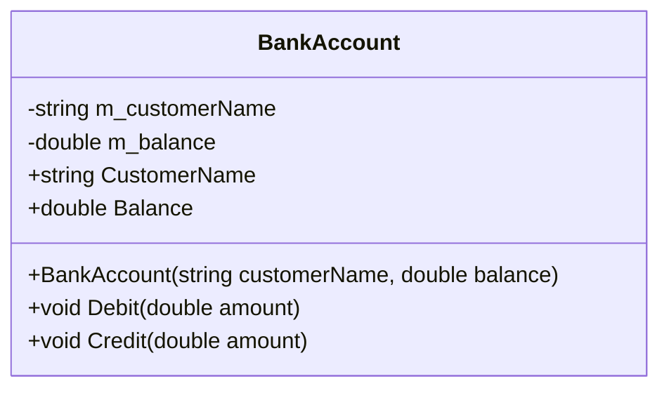

# Diagrama de Clases - Bank Application

## Bank.WebApi.Models

## Descripción

### BankAccount
Clase principal que representa una cuenta bancaria con las siguientes características:

- **m_customerName**: Nombre del cliente (solo lectura)
- **m_balance**: Saldo de la cuenta
- **Debit(amount)**: Permite realizar un débito de la cuenta. Lanza `ArgumentOutOfRangeException` si el monto es mayor al saldo o negativo.
- **Credit(amount)**: Permite realizar un crédito a la cuenta. Lanza `ArgumentOutOfRangeException` si el monto es negativo.

